# ⚡️ AlphaEngine – Confidential Multichain Liquidity Markets for Uniswap Hooks

<div align="center">
  <h3>Built on Uniswap v4 • EigenLayer AVS • Zama FHEVM • Avail Nexus SDK</h3>
  <p>We turn Uniswap liquidity into a private, competitive marketplace where elite strategists deploy capital across DeFi — without ever leaking alpha.</p>
  <p>
    <a href="https://alpha-engine-zama.vercel.app/">🌐 Live App</a> •
    <a href="https://www.youtube.com/watch?v=APvFKz0IEps">🎥 AlphaEngine Demo (Strategies)</a> •
    <a href="https://youtu.be/sYnSRw6ADEo">🎥 Privacy Hook Demo (Swaps & AVS, Old Demo)</a>
  </p>
  <p>
    <a href="#-why-alphaengine">Why AlphaEngine</a> •
    <a href="#-what-we-built">What We Built</a> •
    <a href="#-architecture-at-a-glance">Architecture</a> •
    <a href="#-confidential-liquidity-flow">Liquidity Flow</a> •
    <a href="#-strategy-lifecycle">Strategy Lifecycle</a> •
    <a href="#-zama-multichain--nexus-sdk">ZAMA Multichain</a> •
    <a href="#-getting-started">Getting Started</a> •
    <a href="#-testing--tooling">Testing & Tooling</a>
  </p>
</div>

---

## 🎯 Why AlphaEngine

### DeFi’s Glass-House Problem
- Every swap telegraphs size, timing, and direction; bots front-run and steal value.
- Yield products depend on closed vault teams, not market-wide competition.
- Liquidity providers in Hooks pools cannot invite external talent without giving away their edge.

### The AlphaEngine Thesis
AlphaEngine fuses **Uniswap v4 hooks**, **EigenLayer AVS operators**, and **Zama confidential compute** so that:
- Swaps become **private by default** — intents are encrypted, batched, and only a single net flow hits the chain, eliminating MEV extraction.
- Uniswap liquidity becomes **market-driven** — strategists submit encrypted intents that are simulated by our AVS and deployed if they outperform.
- Execution goes **multichain without trust trade-offs** — trades are verified on Ethereum (Sepolia) and forwarded to Base via the Nexus SDK with the same security and privacy guarantees.

In short, AlphaEngine lets performance — not privileged order flow — decide who wins.

---

## 🧱 What We Built

- **AlphaEngine Hook** (`UniversalPrivacyHook.sol`): a Uniswap v4 hook that mints encrypted LP shares, collects swap intents, and exposes a secure strategy submission surface.
- **Strategy Arena**: strategists encrypt calldata (destination protocol, selector, args) and compete for capital allocation. The AVS simulates, ranks, and deploys the winners.
- **EigenLayer AVS Network**: a restaked operator set that decrypts intents under FHE permissions, nets flows, verifies strategy safety, and signs settlements.
- **ZAMA Multichain via Nexus SDK**: unified execution pipeline that originates trades on Ethereum Sepolia, verifies with the AVS, and dispatches aggregated payloads to Base Sepolia while preserving Ethereum-grade privacy.
- **Frontend Experience** (`packages/site`): connect wallet, mint test liquidity, track private batches, submit encrypted strategies, and watch multi-chain executions.

> 🔁 CypherTradeArena inspired our competitive strategy layer, but AlphaEngine goes further: winners actually deploy Uniswap hook liquidity under encryption, rather than scoring points in an isolated battle.

---

## 🏗️ Architecture at a Glance

```
┌──────────────┐       ┌──────────────────────┐       ┌───────────────────────┐
│   Traders    │──────▶│ AlphaEngine Hook     │──────▶│ Encrypted Token Vault │
│ (LPs & Pros) │       │ (Uniswap v4 before/  │       │   (Hybrid FHERC20)    │
└──────────────┘       │  after swap hooks)   │       └───────────┬───────────┘
        │              └─────────────┬────────┘                   │
        │ Encrypted intents          │ Finalized batches           │
        ▼                            ▼                             ▼
┌──────────────────┐      ┌────────────────────┐        ┌─────────────────────┐
│ Frontend + SDK   │◀────▶│ EigenLayer AVS     │◀──────▶│ Nexus SDK Dispatcher │
│ (Zama clients)   │      │ (decrypt, match,   │        │ (Base / other L2s)  │
└──────────────────┘      │  simulate, settle) │        └──────────┬──────────┘
                                   │                                │
                                   ▼                                ▼
                        ┌─────────────────────┐        ┌────────────────────────┐
                        │ Net Hook Settlement │        │ Target Protocols (L2s) │
                        │ (Ethereum Sepolia)  │        │  Aave, Morpho, etc.    │
                        └─────────────────────┘        └────────────────────────┘
```

- **Privacy wall**: Users encrypt balances locally; only netted public flows touch the AMM.
- **Competitive layer**: Strategists share proofs of performance, not raw calldata.
- **Cross-domain execution**: Nexus SDK ferries AVS-approved payloads to Base while referencing Ethereum-origin attestations.

---

## 🔒 Confidential Liquidity Flow

```mermaid
%%{init: {'theme':'dark', 'themeVariables': { 'primaryColor':'#00c2ff', 'primaryTextColor':'#fff', 'primaryBorderColor':'#00a7d7', 'lineColor':'#00c2ff', 'secondaryColor':'#ff6b6b', 'tertiaryColor':'#3700b3', 'background':'#111', 'mainBkg':'#1b1b1b', 'secondBkg':'#242424', 'labelBackground':'#242424', 'labelTextColor':'#fff', 'actorBkg':'#2f2f2f', 'actorBorder':'#00c2ff', 'actorTextColor':'#fff', 'signalColor':'#00c2ff', 'signalTextColor':'#fff'}}}%%
sequenceDiagram
    participant User as LP / Trader
    participant Frontend as Frontend + Zama SDK
    participant Hook as AlphaEngine Hook<br/>(Uniswap v4)
    participant FHE as Zama FHEVM
    participant AVS as EigenLayer AVS Operators
    participant Pool as Uniswap v4 Pool

    rect rgb(30,60,80)
        Note over User,Hook: PHASE 1 · Confidential Onboarding
        User->>Hook: deposit(token, amount)
        Hook->>FHE: mintEncrypted(token, amount)
        FHE-->>Hook: eToken handles
        Hook-->>User: credits encrypted balance
    end

    rect rgb(50,80,60)
        Note over User,AVS: PHASE 2 · Intent Collection (5-block epochs)
        User->>Frontend: request encryption session
        Frontend->>FHE: encrypt(amount, direction)
        Frontend-->>User: handles + inputProof
        User->>Hook: submitEncryptedIntent(handles, inputProof)
        Hook->>Hook: queue intent in epoch buffer
    end

    rect rgb(60,40,80)
        Note over AVS,Pool: PHASE 3 · Off-chain Matching & Settlement
        Hook->>AVS: finalizeEpoch(epochId, intentMerkleRoot)
        AVS->>FHE: batchDecrypt(handles[])
        AVS->>AVS: match opposing intents & compute net swap
        AVS->>Hook: settleEpoch(internalTransfers, netSwap, signatures)
        par Internal Transfers
            Hook->>FHE: burn/mint encrypted balances
        and Net Swap
            Hook->>Pool: swap(netUSDC, netUSDT)
        end
        Hook-->>User: updated encrypted balances
    end

    rect rgb(20,80,50)
        Note over User,Pool: RESULT · MEV-free swaps, zero IL on matched flow
    end
```



---

## 🏆 Strategy Lifecycle


**Key difference vs CypherTradeArena:** AlphaEngine deploys actual Hook liquidity, not paper competitions. Strategists prove performance confidentially, win capital slots, and their calldata hits live DeFi rails once consensus is reached.

---

## 🌐 ZAMA Multichain & Nexus SDK

- **Single source of truth:** All trades originate on Ethereum Sepolia where the AVS verifies encrypted intents against the Hook state.
- **EigenLayer-backed validity:** Operator signatures attest to both the decrypted strategy parameters and the safety checks performed off-chain.
- **Nexus SDK dispatch:** Using Avail’s Nexus SDK, those attestations are packaged into cross-domain payloads. Base Sepolia executes only after verifying Ethereum-side proofs, so the privacy and correctness level matches Ethereum.
- **ZAMA FHE everywhere:** We extended ZAMA’s FHE toolchain to produce handles that remain valid across chains, enabling seamless encrypted state updates even after a cross-chain hop.

Result: **ZAMA is now multichain** — strategies are encrypted on Ethereum, routed to Base (or any Nexus-supported domain), and remain private end-to-end.

---

## 🧩 Component Deep Dive

- **Hook & Encrypted Tokens** (`packages/fhevm-hardhat-template/contracts/UniversalPrivacyHook.sol`, `HybridFHERC20.sol`)
  - Collect deposits, mint encrypted LP shares, queue swap intents, settle net flows.
  - Exposes `submitStrategyIntent` entry point for strategists, enforcing epoch windows and collateralization.

- **Strategy Manager & AVS** (`packages/fhevm-hardhat-template/contracts` + AVS scripts in `packages/fhevm-hardhat-template/avs`)
  - Maintains epoch state, permissions, and aggregated performance reports.
  - Operators use Zama Gateway + EigenLayer middleware to decrypt, simulate, and sign settlements.

- **Frontend** (`packages/site`)
  - React / Next.js app using `@zama-fhe/relayer-sdk`.
  - Modules: encrypted faucet, LP dashboard, strategist submission wizard, Nexus dispatch monitor.

- **Documentation & Specs**
  - `UEI_ARCHITECTURE.md` – universal encrypted intents.
  - `AVS_INTEGRATION_PLAN.md` – restaked operator responsibilities.
  - `MIGRATION_TO_ZAMA.md` – steps taken to unlock Nexus-powered multichain.
  - `FHENIX_ARCHITECTURE.md` – FHE schema and permissioning model.

---

## 📜 Deployed Contracts

### Base Sepolia (`chainId 84532`)

| Component | Address |
|-----------|---------|
| `USDC` | [`0x9c14aC9E88Eb84Fc341291FBf06B891592E3bcC7`](https://sepolia.basescan.org/address/0x9c14aC9E88Eb84Fc341291FBf06B891592E3bcC7) |
| `USDT` | [`0x0f1333EaFF107C4d205d2d80b567D003d7870ad5`](https://sepolia.basescan.org/address/0x0f1333EaFF107C4d205d2d80b567D003d7870ad5) |
| `PT_eUSDE` | [`0xFF9F206B333C902Af93426f7b6630F103cB85309`](https://sepolia.basescan.org/address/0xFF9F206B333C902Af93426f7b6630F103cB85309) |
| `PT_sUSDE` | [`0x4cabe68B3C6d65F7f12cDDa41998257b6E16DF16`](https://sepolia.basescan.org/address/0x4cabe68B3C6d65F7f12cDDa41998257b6E16DF16) |
| `PT_USR` | [`0xfB8C7bE6BAfB392BF2386EBD616916f08e2d5E1f`](https://sepolia.basescan.org/address/0xfB8C7bE6BAfB392BF2386EBD616916f08e2d5E1f) |
| `pendle` | [`0x81095fCdb1502B986a6A3ce33323412d45167364`](https://sepolia.basescan.org/address/0x81095fCdb1502B986a6A3ce33323412d45167364) |
| `aave` | [`0x7cAC40567e1891902eeafE3fD10FfC3ED4043252`](https://sepolia.basescan.org/address/0x7cAC40567e1891902eeafE3fD10FfC3ED4043252) |
| `morpho` | [`0x909D68D8A57Ab8F62B6391e117a77B215Ab21Dfc`](https://sepolia.basescan.org/address/0x909D68D8A57Ab8F62B6391e117a77B215Ab21Dfc) |
| `swapManager` | [`0x62E43c9E8F7C8b94298C97492339e866FF8Fb0a5`](https://sepolia.basescan.org/address/0x62E43c9E8F7C8b94298C97492339e866FF8Fb0a5) |
| `boringVault` | [`0xA63D871F2C63E5fEB160094a0a0A0a6Db657aA63`](https://sepolia.basescan.org/address/0xA63D871F2C63E5fEB160094a0a0A0a6Db657aA63) |

### Ethereum Sepolia (`chainId 11155111`)

| Component | Address |
|-----------|---------|
| `USDC` | [`0x59dd1A3Bd1256503cdc023bfC9f10e107d64C3C1`](https://sepolia.etherscan.io/address/0x59dd1A3Bd1256503cdc023bfC9f10e107d64C3C1) |
| `USDT` | [`0xB1D9519e953B8513a4754f9B33d37eDba90c001D`](https://sepolia.etherscan.io/address/0xB1D9519e953B8513a4754f9B33d37eDba90c001D) |
| `PT_eUSDE` | [`0xfD3e5E9185f6a3aa32edEAD5974BDDBbf28F4af1`](https://sepolia.etherscan.io/address/0xfD3e5E9185f6a3aa32edEAD5974BDDBbf28F4af1) |
| `PT_sUSDE` | [`0x9a97e4D94dB48dC4b9cAB30Da5f45d4DD8b73AE4`](https://sepolia.etherscan.io/address/0x9a97e4D94dB48dC4b9cAB30Da5f45d4DD8b73AE4) |
| `PT_USR` | [`0x59B016C0c8Ad39672c5C27363ADef8Cae4dA2Cdc`](https://sepolia.etherscan.io/address/0x59B016C0c8Ad39672c5C27363ADef8Cae4dA2Cdc) |
| `pendle` | [`0x5b74d9186EEAf2b517EBe626cdDbe46C49B77Eb5`](https://sepolia.etherscan.io/address/0x5b74d9186EEAf2b517EBe626cdDbe46C49B77Eb5) |
| `aave` | [`0x94cD44b66E5E64045F1075dB6eF42af383108e87`](https://sepolia.etherscan.io/address/0x94cD44b66E5E64045F1075dB6eF42af383108e87) |
| `morpho` | [`0x4995F1aaA2E74EF7b28C9D5f14eC4A026B46Cc76`](https://sepolia.etherscan.io/address/0x4995F1aaA2E74EF7b28C9D5f14eC4A026B46Cc76) |
| `swapManager` | [`0x8E9F2dc2EB224e76f7dBf7704c68D214430B201B`](https://sepolia.etherscan.io/address/0x8E9F2dc2EB224e76f7dBf7704c68D214430B201B) |
| `boringVault` | [`0x1B7Bbc206Fc58413dCcDC9A4Ad1c5a95995a3926`](https://sepolia.etherscan.io/address/0x1B7Bbc206Fc58413dCcDC9A4Ad1c5a95995a3926) |

---

## 🚀 Getting Started

### Prerequisites
- Node.js v18+
- pnpm or npm
- MetaMask connected to Sepolia + Base Sepolia
- Sepolia ETH & Base Sepolia ETH (for gas)

### Install & Bootstrap

```bash
git clone https://github.com/yourusername/fhevm-react-template.git
cd fhevm-react-template
npm install

# Configure contracts
cd packages/fhevm-hardhat-template
cp .env.example .env
# Populate MNEMONIC, INFURA_API_KEY / ALCHEMY_KEY, NEXUS_API_KEY
```

### Run the App

```bash
# Terminal 1 – local contracts (optional)
cd packages/fhevm-hardhat-template
npx hardhat node

# Terminal 2 – deploy to localhost or Sepolia
npx hardhat deploy --network localhost
# or
npx hardhat deploy --network sepolia

# Terminal 3 – frontend
cd packages/site
npm run dev
# open http://localhost:3000
```

### Experience the Flow
1. **LP onboarding** – mint test USDC/USDT, deposit into the Hook, and verify encrypted balances.
2. **Submit encrypted swap** – watch it join the epoch queue and settle with zero MEV leakage.
3. **Strategy submission** – craft an intent targeting Base (e.g., lending on Aave), encrypt locally, and submit.
4. **Operator simulation** – track the AVS dashboard confirming decrypt → simulate → approve flow.
5. **Nexus dispatch** – inspect the cross-chain payload hitting Base and see the Hook’s liquidity put to work.

---

## 🧪 Testing & Tooling

```bash
# Smart-contract tests
cd packages/fhevm-hardhat-template
npx hardhat test

# Helper tasks
npx hardhat task:check-balances --network sepolia
npx hardhat task:test-intent --amount 100 --network sepolia
npx hardhat task:finalize-epoch --network sepolia

# AVS operator harness
cd packages/fhevm-hardhat-template/avs
npm install
npm run simulate          # local decrypt + matching tests
npm run nexus:dispatch    # dry-run cross-chain payload
```

> Operators can re-use the CipherTradeArena toolchain; AlphaEngine’s AVS bundle extends it with Hook-aware simulations and Nexus attestations.

---

## 🧭 Roadmap

- Expand Nexus destinations beyond Base (Linea, Scroll) while preserving FHE guarantees.
- Permissionless strategist onboarding backed by slashing conditions.
- Dynamic risk rails that auto-cap strategy exposure based on encrypted VaR metrics.
- zk attestations for on-chain proof that AVS verified simulations followed policy.

---

## 📄 License

MIT © AlphaEngine Contributors

---

AlphaEngine transforms Uniswap hooks from passive AMMs into a confidential, competition-driven liquidity engine — ready for the next wave of private, multichain DeFi.