This is the end-to-end swap path for AlphaEngine, generalized for the CoFHE processor.

```mermaid
%%{init: {'theme':'dark', 'themeVariables': { 'primaryColor':'#00c2ff', 'primaryTextColor':'#fff', 'primaryBorderColor':'#00a7d7', 'lineColor':'#00c2ff', 'secondaryColor':'#ff6b6b', 'tertiaryColor':'#3700b3', 'background':'#111', 'mainBkg':'#1b1b1b', 'secondBkg':'#242424', 'labelBackground':'#242424', 'labelTextColor':'#fff', 'actorBkg':'#2f2f2f', 'actorBorder':'#00c2ff', 'actorTextColor':'#fff', 'signalColor':'#00c2ff', 'signalTextColor':'#fff'}}}%%
sequenceDiagram
    participant User as LP / Trader
    participant Frontend as Frontend + CoFHE SDK
    participant Hook as AlphaEngine Hook<br/>(Uniswap v4)
    participant CoFHE as CoFHE Processor
    participant AVS as EigenCompute Operators
    participant Pool as Uniswap v4 Pool

    rect rgb(30,60,80)
        Note over User,Hook: PHASE 1 · Confidential Onboarding
        User->>Hook: deposit(token, amount)
        Hook->>CoFHE: mintEncrypted(token, amount)
        CoFHE-->>Hook: eToken handles
        Hook-->>User: credits encrypted balance
    end

    rect rgb(50,80,60)
        Note over User,AVS: PHASE 2 · Intent Collection (epochs)
        User->>Frontend: request encryption session
        Frontend->>CoFHE: encrypt(amount, direction)
        Frontend-->>User: handles + inputProof
        User->>Hook: submitEncryptedIntent(handles, inputProof)
        Hook->>Hook: queue intent in epoch buffer
    end

    rect rgb(60,40,80)
        Note over AVS,Pool: PHASE 3 · Off-chain Matching & Settlement
        Hook->>AVS: finalizeEpoch(epochId, intentMerkleRoot)
        AVS->>CoFHE: batchDecrypt(handles[])
        AVS->>AVS: match opposing intents & compute net swap
        AVS->>Hook: settleEpoch(internalTransfers, netSwap, signatures)
        par Internal Transfers
            Hook->>CoFHE: burn/mint encrypted balances
        and Net Swap
            Hook->>Pool: swap(netUSDC, netUSDT)
        end
        Hook-->>User: updated encrypted balances
    end

    rect rgb(20,80,50)
        Note over User,Pool: RESULT · MEV-free swaps, zero IL on matched flow
    end
```

- **Privacy wall**: ciphertexts stay opaque until operators have permission.
- **Batch discipline**: epochs bound how long an intent can sit in a queue.
- **On-chain footprint**: only the net swap hits the pool; everything else is encrypted bookkeeping.

See also: [System Architecture](/architecture/system-architecture) and [CoFHE processor primer](/compute/cofhe-coprocessor).
