```mermaid
%%{init: {'theme':'dark', 'themeVariables': { 'primaryColor':'#a855f7', 'primaryTextColor':'#fff', 'primaryBorderColor':'#9333ea', 'lineColor':'#a855f7', 'secondaryColor':'#3b82f6', 'tertiaryColor':'#10b981', 'background':'#111', 'mainBkg':'#1b1b1b', 'secondBkg':'#242424', 'labelBackground':'#242424', 'labelTextColor':'#fff', 'actorBkg':'#2f2f2f', 'actorBorder':'#a855f7', 'actorTextColor':'#fff', 'signalColor':'#a855f7', 'signalTextColor':'#fff'}}}%%
sequenceDiagram
    participant Strategist as Strategist Wallet
    participant SDK as CoFHE Client SDK
    participant Manager as StrategyManager (Hook AVS entry)
    participant AVS as EigenCompute AVS
    participant Nexus as Nexus SDK
    participant Base as Base Sepolia Protocols

    rect rgb(30,50,90)
        Note over Strategist,Manager: STAGE 1 · Encrypted Submission
        Strategist->>SDK: encrypt(targetChainId, protocol, selector, args[])
        SDK-->>Strategist: handles[], proof
        Strategist->>Manager: submitStrategy(epochId, handles[], proof)
        Manager->>AVS: grantCoFHEPermission(epochId, strategyId)
    end

    rect rgb(40,80,60)
        Note over AVS,Nexus: STAGE 2 · Simulation & Ranking
        AVS->>Manager: fetchEncryptedStrategy(strategyId)
        AVS->>SDK: batchDecrypt(handles[])
        AVS->>AVS: simulate with vault snapshot (notional)
        AVS->>SDK: encryptAPY(result)
        AVS->>Manager: reportEncryptedAPY(strategyId, payload)
        Manager->>AVS: emit StrategyEvaluated
        AVS->>AVS: rank top strategies per epoch
    end

    rect rgb(80,60,40)
        Note over AVS,Base: STAGE 3 · Verified Multichain Execution
        AVS->>Manager: finalizeEpoch(winners, proofs)
        Manager->>Manager: aggregate calldata bundles
        AVS->>Nexus: requestDispatch(bundle, attestation)
        Nexus->>Base: relay aggregated calldata to target protocol
        Base-->>Manager: execution receipts
        Manager-->>Strategist: share encrypted performance rewards
    end
```

- Strategies stay encrypted through ranking; operators only open what they are permitted to simulate.
- Nexus dispatch preserves the Ethereum-origin attestations so Base (or other L2s) inherit the same privacy and correctness guarantees.

See also: [CoFHE processor](/compute/cofhe-coprocessor), [EigenCompute & operators](/compute/eigencompute-operators), and [Deployments](/reference/deployments).
