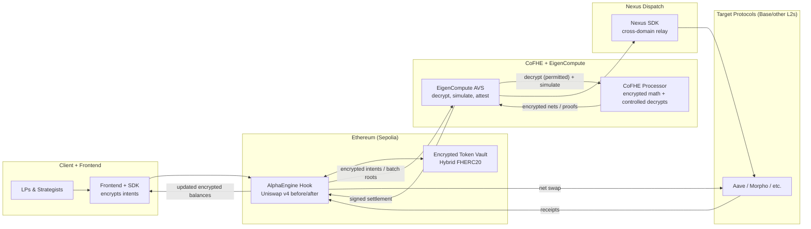

AlphaEngine turns Uniswap v4 liquidity into a private, competitive marketplace: intents stay encrypted, batches are net-settled, and restaked operators attest to every move.

{/*  */}

## Watch the explainer

Checkout our awesome and intuitive explanation of AlphaEngine.

  <iframe
    src="https://www.youtube.com/embed/BCKkb_RXlyA"
    title="AlphaEngine explainer"
    style={{ position: "absolute", top: 0, left: 0, width: "100%", height: "100%" }}
    frameBorder="0"
    allow="accelerometer; autoplay; clipboard-write; encrypted-media; gyroscope; picture-in-picture; web-share"
    allowFullScreen
  />

## Problem & why it matters

- **Glass-house swaps**: Showing intent in the mempool leaks size, timing, and direction; MEV picks off orderflow.
- **Closed-kitchen yield**: LPs must trust one internal team per protocol; real quants won’t ship alpha on transparent rails.
- **No competition without privacy**: Without encryption, you cannot rank strategies or route liquidity without giving away the recipe.

<Callout>
  AlphaEngine is a private strategy and execution layer for Uniswap: quants send
  encrypted strategies and swap intents; we simulate, rank, and route liquidity
  to the winners—without revealing their edge.
</Callout>

## Who we serve

- **On-chain LPs and funds** already allocating to stablecoin/Hook liquidity who want competitive, private execution.
- **Independent quants/strategists** who want to deploy on-chain without leaking alpha.
- **Traders** who want private swaps and netted settlement that minimizes MEV exposure.

## Why AlphaEngine

### DeFi’s glass-house problem
- Swaps telegraph size, timing, and direction; MEV bots front-run and back-run.
- LPs cannot invite external strategists without leaking their edge.
- Cross-chain execution introduces more leak points and inconsistent trust.

### The AlphaEngine thesis
- **Private by default** — intents are encrypted, batched, and only a single net swap hits the chain.
- **Competition over privilege** — strategists submit encrypted intents, get simulated by EigenCompute operators, and only winning flows deploy.
- **Multichain without trust trade-offs** — Ethereum-origin attestations travel through the Nexus SDK to L2s with the same privacy and correctness guarantees.

## Why now

- **Practical CoFHE**: On-chain FHE and coprocessors have matured enough for real-time encrypted flows.
- **Native integration point**: Uniswap v4 hooks let us embed privacy + batching without forking the AMM.
- **Market pull**: Stablecoin/yield markets are booming, institutions are moving on-chain, and privacy-by-default is becoming a requirement.

## What we built

- **AlphaEngine hook**: Uniswap v4 before/after hook that mints encrypted LP shares, queues intents, and exposes a strategy submission surface.
- **Strategy arena**: Strategists encrypt calldata and compete for allocations; the AVS simulates, ranks, and deploys the winners.
- **EigenCompute AVS**: Restaked operators decrypt (when permitted), net batches, simulate Universal Trade Intents, and sign settlements.
- **CoFHE processor**: Runs encrypted math and controlled decrypts; contracts never see plaintext.
- **Nexus dispatch**: Ethereum-origin batches forward to Base (and other L2s) via Nexus while preserving CoFHE guarantees.
- **Frontend experience**: Encrypts client-side, submits multi-intent sessions, and tracks batches through settlement.

## Architecture at a glance

- **Privacy wall**: Intents and balances stay encrypted; only netted public flows touch the AMM.
- **Competitive layer**: Strategists compete via encrypted submissions; EigenCompute attests to winners.
- **Cross-domain execution**: Nexus relays AVS-approved payloads to L2s with Ethereum-origin attestations.

## Key promises

- **Private by default**: Encrypted intents end-to-end; only net public flows touch the pool.
- **Performance-driven**: Liquidity routes to the best-performing strategies, not the loudest orderflow.
- **Multichain-ready**: Ethereum-origin attestations travel through Nexus to L2s with the same guarantees.

## Show, don’t tell

- **Three broken pillars**: Low yield, alpha leakage, MEV (see above).
- **Yield uplift**: [Before](/images/deck/alphaengine-06.png) vs [After](/images/deck/alphaengine-07.png).
- **Privacy for swaps**: [Without AlphaEngine](/images/deck/alphaengine-10.png) vs [With AlphaEngine](/images/deck/alphaengine-11.png).
- **Strategy-to-yield path**: [How we increase LP yield](/images/deck/alphaengine-08.png).

## Where to go next

- See the [Confidential Liquidity Flow](/architecture/confidential-liquidity-flow) for the end-to-end swap path.
- Review the [Strategy Lifecycle](/architecture/strategy-lifecycle) for strategist submissions and multichain dispatch.
- Jump to the [CoFHE processor primer](/compute/cofhe-coprocessor) and [EigenCompute & operators](/compute/eigencompute-operators) for compute details.
- Use the [Quickstart](/guides/quickstart) to run contracts, operator, and frontend locally.
